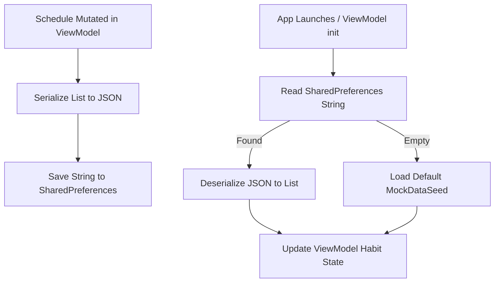

# SPEC10: Local JSON Schedule Persistency

## 1. Objective
Ensure that all habits created, modified, or completed by the user survive app termination (e.g., closing the app, process death). This ensures data stability during the live hackathon pitch without introducing complex database migration layers.

## 2. Technical Strategy
*   **Storage Medium:** Android `SharedPreferences` (private mode).
*   **Serialization:** Convert the `List<HabitBlock>` state to a JSON string using `Gson` or a lightweight native serializer, and save it on every schedule mutation.
*   **Retrieval:** On ViewModel initialization (`init` block), attempt to load and deserialize the saved state. If empty or corrupt, fall back to seeding the database with the default `MockDataSeed`.

## 3. Data Flow

## 4. Proposed Changes

### ViewModel Integration (`RoutInViewModel.kt`)
*   Add a key constant: `private const val KEY_HABITS_PREF = "routin_habits_json"`
*   Create a private helper `fun saveHabitsToPrefs()` that serializes `_habitBlocks.value` and saves it using `edit().putString().apply()`.
*   Update `mutateHabitBlocks` to call `saveHabitsToPrefs()` immediately after mutations are finalized and collisions are resolved.
*   In the `init` block, read `KEY_HABITS_PREF`. If it exists, deserialize it and set `_habitBlocks.value`. Otherwise, call the existing mock seeding logic.
