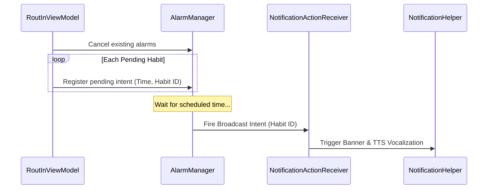

# SPEC11: Precise Alarm Triggering (AlarmManager)

## 1. Objective
Enable precise, OS-level scheduling alarms that fire real notifications and trigger physical haptic feedback at the exact time a habit block is scheduled to start.

## 2. Technical Strategy
*   **Trigger Component:** Android `AlarmManager` utilizing `setExactAndAllowWhileIdle()` (or inexact scheduling to bypass exact alarm permission blocks in Android 13+).
*   **Receiver:** Register a standard `BroadcastReceiver` (reusing or extending `NotificationActionReceiver`) to intercept the alarm intent.
*   **Payload:** Pass the target Habit ID and Name via the intent extras to display a localized, contextually accurate banner ("¡Es hora de: Gimnasio!").

## 3. Alarm Dispatch Sequence

## 4. Proposed Changes

### Alarm Configuration & Broadcast Receiver
*   **Manifest Permission:** `<uses-permission android:name="android.permission.SCHEDULE_EXACT_ALARM" />` (optional fallback for standard alarms to maintain simple runtime profiles).
*   **ViewModel Trigger Hook:** A new method `fun rescheduleAlarms()` that iterates over all habits with `status == PENDING`. For each, parse the `"HH:mm"` into calendar milliseconds today and register a pending intent with the system `AlarmManager`.
*   **Integration Point:** Call `rescheduleAlarms()` inside the existing `mutateHabitBlocks` routine so that shifting, editing, or deleting a habit dynamically updates the system's scheduled alarms in real-time.
